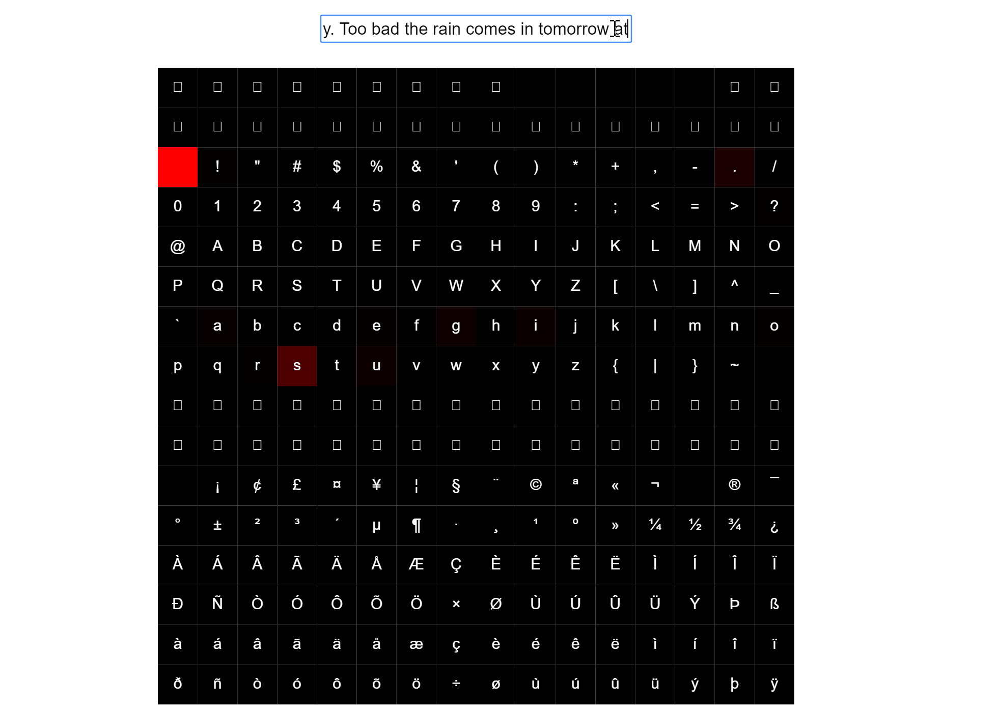

# twitter-RNN
🐦 Learning to compose Tweets using recurrent neural networks.



## Usage
Training:
```
npm run charRNN:train
```
Testing:
```
npm run charRNN:test
```
Predicting:
```
npm run charRNN:predict --beam-width 20 --beam-depth 20 --seed "@LOLTrish hey  long time no see! Yes.. Rains a bit, only a bit LOL, I'm fine tha"
```
| Flag         | Description                                          |
|--------------|------------------------------------------------------|
| --beam-width | The number of branches to split into at each stage   |
| --beam-depth | The number of characters to generate                 |
| --seed       | The seed to use, must be at least 60 characters long |